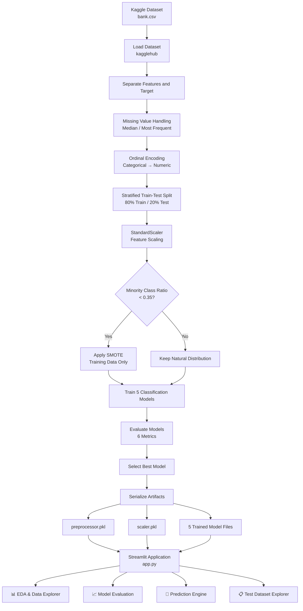

# 🏦 Bank Marketing Term Deposit Classification Pipeline

**Program:** M.Tech Data Science & Engineering | BITS Pilani
**Course:** Machine Learning Assignment 2

---

## 📌 Project Overview

This project implements an end-to-end Machine Learning pipeline and an interactive **Streamlit web application** to predict whether a banking client will subscribe to a term deposit based on direct marketing campaign attributes.

The project covers the complete Machine Learning lifecycle:

* Dataset ingestion using `kagglehub`
* Data preprocessing and defensive imputation
* Categorical feature encoding
* Stratified train-test splitting
* Feature scaling using `StandardScaler`
* Conditional class balancing using SMOTE
* Training of five classification algorithms
* Evaluation using six classification metrics
* Model comparison and best-model selection
* Model and preprocessing artifact serialization
* Interactive Exploratory Data Analysis
* ROC and Precision-Recall analysis
* Feature importance analysis
* Single-customer prediction
* Batch CSV prediction
* Test dataset exploration
* Interactive Streamlit deployment

---

# 🏗️ System Architecture & Data Flow

The following architecture represents the complete Machine Learning pipeline from data ingestion to Streamlit deployment.



---

# 🔄 Machine Learning Pipeline

The project is divided into the following phases:

| Phase                              | Description                                                                           |
| :--------------------------------- | :------------------------------------------------------------------------------------ |
| **Phase 1 — Data Engineering**     | Dataset ingestion, target separation, missing-value handling and categorical encoding |
| **Phase 2 — Feature Engineering**  | Stratified train-test splitting, feature scaling and conditional SMOTE                |
| **Phase 3 — Model Training**       | Training five classification algorithms                                               |
| **Phase 4 — Model Evaluation**     | Evaluation using Accuracy, ROC-AUC, Precision, Recall, F1 and MCC                     |
| **Phase 5 — Model Serialization**  | Saving preprocessing objects and trained models as `.pkl` files                       |
| **Phase 6 — Streamlit Deployment** | Interactive EDA, model evaluation, prediction and dataset exploration                 |

---

# 📏 Feature Scaling — `StandardScaler`

Feature scaling transforms numerical features so that they have approximately:

* Mean = **0**
* Standard deviation = **1**

## Why Scaling is Necessary

Scaling is particularly important for algorithms that depend on distances or numerical optimization.

### K-Nearest Neighbors

KNN calculates distances between observations. Features with larger numerical ranges can dominate the distance calculation.

For example:

* `balance` may have values ranging across thousands.
* `campaign` may contain relatively small integer values.

Without scaling, `balance` could disproportionately influence the distance calculation.

### Logistic Regression

Logistic Regression benefits from standardized features because numerical optimization becomes more stable and efficient when features are on comparable scales.

### Tree-Based Models

Decision Trees and Random Forests are generally insensitive to feature scaling because they split observations using feature thresholds.

However, the project maintains a common preprocessing and scaling pipeline so that the same standardized feature representation can be supplied consistently to the different models.

---

# ⚖️ Conditional SMOTE Implementation

**Synthetic Minority Over-sampling Technique (SMOTE)** generates synthetic observations for the minority class.

Instead of automatically applying SMOTE to every dataset, the pipeline first checks the minority-class ratio.

$$
\text{Minority Ratio}
=====================

\frac{\text{Minority Class Count}}
{\text{Total Training Samples}}
$$

The decision logic is:

```text
IF Minority Ratio < 0.35
        ↓
   Apply SMOTE
        ↓
Training Dataset

IF Minority Ratio >= 0.35
        ↓
Preserve Natural Distribution
```

## Preventing Data Leakage

SMOTE is applied **only to the training partition**.

```text
Original Dataset
       │
       ▼
Train / Test Split
       │
       ├── Training Data
       │       │
       │       ▼
       │    Scaling
       │       │
       │       ▼
       │     SMOTE
       │       │
       │       ▼
       │   Model Training
       │
       └── Test Data
               │
               ▼
            Scaling
               │
               ▼
         Model Evaluation
```

The test dataset remains untouched so that evaluation reflects real-world model performance.

> **Note:** The exact target distribution displayed by the Streamlit application is calculated dynamically from `data/test_data.csv`.

---

# 🔍 Exploratory Data Analysis

The Streamlit application now contains an enhanced EDA dashboard.

## 🎯 1. Target Distribution

The application dynamically calculates:

* Total customers
* Number of subscribed customers
* Number of non-subscribed customers
* Percentage of each class

This avoids hard-coding target percentages.

The application displays both KPI cards and a target distribution chart.

---

## 📞 2. Contact Duration Analysis

The application provides:

### Call Duration by Outcome

A boxplot compares call duration between:

* `deposit = yes`
* `deposit = no`

### Average Call Duration

A separate chart displays the average contact duration for each outcome.

This allows the user to visually examine the relationship between call duration and subscription success.

> **Important:** `duration` is typically available after a marketing call has taken place. Therefore, if the model is intended for pre-call targeting, this feature should be evaluated carefully for potential target leakage or deployment-time availability issues.

---

# 👥 Customer Segment Analysis

The application provides an interactive categorical-feature explorer.

Users can select from available categorical variables such as:

* Job
* Marital status
* Education
* Housing loan
* Personal loan
* Contact type
* Previous campaign outcome

For each selected feature, the application calculates the **subscription rate (%)** for each category.

For example:

```text
Job
 │
 ├── Management     → Subscription Rate
 ├── Technician     → Subscription Rate
 ├── Admin          → Subscription Rate
 ├── Student        → Subscription Rate
 └── Retired        → Subscription Rate
```

This provides a more meaningful analysis than simply displaying raw counts.

---

# 🎂 Age Distribution

The application provides an age distribution chart using the `age` feature.

Where the target variable is available, the chart also separates the distribution by subscription outcome.

This helps identify whether particular age groups demonstrate different subscription behavior.

---

# 📐 Numerical Feature Explorer

Users can select any available numerical feature and dynamically generate its distribution.

Examples include:

* Age
* Balance
* Duration
* Campaign
* Previous contacts
* Previous outcome-related numerical attributes

This makes the EDA dashboard reusable instead of limiting it to a fixed set of charts.

---

# 🔥 Correlation Analysis

The application automatically identifies numerical columns and generates a correlation matrix.

The heatmap helps identify:

* Strong positive correlations
* Strong negative correlations
* Weakly correlated variables
* Potential multicollinearity

This analysis is particularly useful when interpreting linear models such as Logistic Regression.

---

# ⚙️ Modeling Methodology

Five classification algorithms are evaluated.

## 1. Logistic Regression

A linear classification model using regularization.

It provides an interpretable baseline for binary classification.

## 2. Decision Tree

A non-linear tree-based classifier that recursively partitions the dataset.

The model uses:

```text
random_state = 42
```

for reproducibility.

## 3. K-Nearest Neighbors

A distance-based, non-parametric classifier.

Feature scaling is particularly important because KNN relies on distances between observations.

## 4. Gaussian Naive Bayes

A probabilistic classifier based on Bayes' theorem and the assumption of conditional feature independence.

## 5. Random Forest

An ensemble classifier consisting of multiple decision trees trained using bootstrap aggregation.

The implementation uses **100 decision trees**.

---

# 🏆 Model Performance

Each model is evaluated using six metrics:

1. Accuracy
2. ROC-AUC
3. Precision
4. Recall
5. F1 Score
6. Matthews Correlation Coefficient

## Performance Comparison

| Model                |   Accuracy |    ROC-AUC |  Precision |     Recall |   F1 Score |        MCC |
| :------------------- | ---------: | ---------: | ---------: | ---------: | ---------: | ---------: |
| Logistic Regression  |     0.7962 |     0.8729 |     0.7831 |     0.7883 |     0.7857 |     0.5915 |
| Decision Tree        |     0.7676 |     0.7662 |     0.7624 |     0.7401 |     0.7511 |     0.5334 |
| KNN                  |     0.7913 |     0.8503 |     0.7863 |     0.7684 |     0.7772 |     0.5811 |
| Gaussian Naive Bayes |     0.7497 |     0.8077 |     0.7014 |     0.8214 |     0.7566 |     0.5088 |
| **Random Forest**    | **0.8495** | **0.9133** | **0.8195** | **0.8752** | **0.8464** | **0.7007** |

---

# 🥇 Best Model — Random Forest

Based on the reported evaluation results, **Random Forest** is the best-performing model.

| Metric    |      Score |
| :-------- | ---------: |
| Accuracy  | **84.95%** |
| ROC-AUC   | **0.9133** |
| Precision | **0.8195** |
| Recall    | **0.8752** |
| F1 Score  | **0.8464** |
| MCC       | **0.7007** |

Random Forest provides the strongest overall performance among the five evaluated algorithms.

---

# 📈 Advanced Model Evaluation

The Streamlit application now provides several additional model evaluation visualizations.

## 📊 Metric Comparison

A grouped bar chart compares all six evaluation metrics across the five models.

This allows users to quickly identify which model performs best across:

* Accuracy
* ROC-AUC
* Precision
* Recall
* F1
* MCC

---

# 📈 ROC Curve Comparison

The application plots the ROC curve for all five models on a single chart.

Each curve displays its corresponding AUC score.

This allows direct comparison of each model's ability to distinguish between:

```text
Subscribed
      vs
Not Subscribed
```

A higher ROC-AUC indicates better discriminatory capability.

---

# 🎯 Precision-Recall Curves

The application also provides Precision-Recall curves for all five models.

These curves are useful for understanding the trade-off between:

* Precision
* Recall

This provides an additional perspective beyond accuracy and ROC-AUC.

---

# 🔍 Confusion Matrix

Users can select any trained model and view its confusion matrix.

The matrix contains:

|                |   Predicted No |  Predicted Yes |
| :------------- | -------------: | -------------: |
| **Actual No**  |  True Negative | False Positive |
| **Actual Yes** | False Negative |  True Positive |

The visualization helps identify the specific types of classification errors made by each model.

---

# 🌳 Random Forest Feature Importance

The application now provides a feature-importance analysis for the Random Forest model.

Users can select how many top features to display.

For example:

```text
Feature                Importance
----------------------------------
duration               ███████████
balance                ███████
age                    █████
campaign               ████
previous               ███
...
```

This helps explain which features contribute most strongly to the Random Forest's predictions.

---

# 🔮 Prediction Engine

The application provides two prediction modes.

---

## 👤 Option 1 — Single Customer Prediction

The user can manually enter customer attributes using an interactive form.

Depending on the feature type:

* Numerical fields → Number input
* Categorical fields → Dropdown selection

The application then performs:

```text
User Input
    ↓
Preprocessor
    ↓
StandardScaler
    ↓
Selected Model
    ↓
Prediction
    ↓
Subscription Probability
```

The result displays:

* Predicted class
* Subscription probability

Example:

```text
Prediction:
YES

Subscription Probability:
87.42%
```

---

# 📁 Option 2 — Batch CSV Prediction

Users can upload a CSV file containing multiple customer records.

The application:

1. Reads the CSV
2. Removes the target column if present
3. Applies the saved preprocessor
4. Applies the saved scaler
5. Runs the selected model
6. Generates predictions
7. Calculates prediction probabilities
8. Displays the results
9. Generates a prediction distribution chart
10. Provides a downloadable CSV

The resulting file contains:

```text
Original Features
       +
Prediction
       +
Probability
```

---

# 📊 Batch Prediction Dashboard

After batch prediction, the application displays:

* Total records
* Number predicted as Yes
* Number predicted as No
* Prediction distribution chart
* Complete prediction table

The results can then be downloaded as:

```text
bank_predictions.csv
```

---

# 📋 Test Dataset Explorer

A new dedicated tab allows users to explore the test dataset directly.

## Features

### 🔎 Filtering

Users can select categorical columns and filter records interactively.

### 📊 Raw Dataset

The filtered records are displayed directly inside the application.

### 📐 Statistical Summary

The application provides descriptive statistics for the filtered dataset.

### 🧹 Missing Value Analysis

The application calculates:

* Missing value count
* Missing percentage

for every column.

### 📥 Download

Users can download the filtered dataset as:

```text
filtered_test_data.csv
```

---

# 🖥️ Streamlit Application Structure

The final application contains four major tabs.

```text
🏦 Bank Marketing Term Deposit Classification
│
├── 📊 EDA & Data Explorer
│   ├── Dataset KPIs
│   ├── Target Distribution
│   ├── Contact Duration Analysis
│   ├── Customer Segment Analysis
│   ├── Age Distribution
│   ├── Numerical Feature Explorer
│   └── Correlation Matrix
│
├── 📈 Model Evaluation
│   ├── Best Model KPI
│   ├── Model Comparison Table
│   ├── Metric Comparison Chart
│   ├── ROC Curves
│   ├── Precision-Recall Curves
│   ├── Confusion Matrix
│   └── Random Forest Feature Importance
│
├── 🔮 Prediction Engine
│   ├── Single Customer Prediction
│   ├── Subscription Probability
│   ├── Batch CSV Prediction
│   ├── Prediction Distribution
│   └── Download Predictions
│
└── 📋 Test Dataset Explorer
    ├── Interactive Filtering
    ├── Dataset Preview
    ├── Statistical Summary
    ├── Missing Value Analysis
    └── Download Filtered Data
```

---

# 💾 Model Artifact Serialization

The application uses pre-trained artifacts stored in the `models/` directory.

```text
models/
├── preprocessor.pkl
├── scaler.pkl
├── logistic.pkl
├── decision_tree.pkl
├── knn.pkl
├── naive_bayes.pkl
└── random_forest.pkl
```

### Artifact Description

| Artifact            | Purpose                                           |
| :------------------ | :------------------------------------------------ |
| `preprocessor.pkl`  | Missing-value imputation and categorical encoding |
| `scaler.pkl`        | StandardScaler transformation                     |
| `logistic.pkl`      | Logistic Regression model                         |
| `decision_tree.pkl` | Decision Tree model                               |
| `knn.pkl`           | KNN model                                         |
| `naive_bayes.pkl`   | Gaussian Naive Bayes model                        |
| `random_forest.pkl` | Random Forest model                               |

The Streamlit application loads these artifacts at runtime and does not retrain the models.

---

# 📁 Repository Structure

```text
ML-Assignment2/
│
├── app.py
│   └── Interactive Streamlit application
│
├── requirements.txt
│   └── Python dependencies
│
├── README.md
│   └── Project documentation
│
├── .gitignore
│   └── Git exclusion rules
│
├── data/
│   └── test_data.csv
│       └── Stratified test dataset
│
└── models/
    ├── preprocessor.pkl
    ├── scaler.pkl
    ├── logistic.pkl
    ├── decision_tree.pkl
    ├── knn.pkl
    ├── naive_bayes.pkl
    └── random_forest.pkl
```

---

# 🛠️ Technology Stack

| Technology           | Purpose                         |
| :------------------- | :------------------------------ |
| **Python**           | Core programming language       |
| **Pandas**           | Data manipulation               |
| **NumPy**            | Numerical computation           |
| **Scikit-learn**     | Machine Learning and evaluation |
| **Imbalanced-learn** | SMOTE                           |
| **Matplotlib**       | Data visualization              |
| **Seaborn**          | Statistical visualization       |
| **Streamlit**        | Interactive web application     |
| **KaggleHub**        | Dataset ingestion               |
| **Pickle**           | Model serialization             |
| **Git / GitHub**     | Version control                 |

---

# ▶️ How to Run the Project

## 1. Clone the Repository

```bash
git clone <YOUR_GITHUB_REPOSITORY_URL>
cd ML-Assignment2
```

## 2. Create Virtual Environment

```bash
python -m venv .venv
```

### Windows

```bash
.venv\Scripts\activate
```

## 3. Install Dependencies

```bash
pip install -r requirements.txt
```

## 4. Run Streamlit

```bash
streamlit run app.py
```

The application will open in the browser.

---

# 🔐 Reproducibility

The project uses fixed random states where applicable.

For example:

```python
random_state=42
```

This improves reproducibility of model training and evaluation.

The Streamlit application uses the same serialized preprocessing objects and trained models used during development.

---

# 📌 Important Modeling Consideration

The `duration` feature is one of the strongest predictors in the reported model results.

However, duration represents the length of the marketing call and may only be known **after the call has occurred**.

Therefore:

* For an academic classification assignment, it is acceptable to evaluate the feature as part of the provided dataset.
* For a real-world **pre-call marketing prediction system**, `duration` should be excluded or treated carefully because it may not be available when the prediction needs to be made.

This distinction is important when moving from an academic model to a production use case.

---

# 📊 End-to-End Workflow

```text
                ┌─────────────────┐
                │  Kaggle Dataset │
                └────────┬────────┘
                         ↓
                ┌─────────────────┐
                │ Data Preprocess  │
                └────────┬────────┘
                         ↓
                ┌─────────────────┐
                │ Feature Encoding │
                └────────┬────────┘
                         ↓
                ┌─────────────────┐
                │ Train/Test Split │
                └────────┬────────┘
                         ↓
                ┌─────────────────┐
                │ Standard Scaling │
                └────────┬────────┘
                         ↓
                ┌─────────────────┐
                │ Conditional     │
                │ SMOTE           │
                └────────┬────────┘
                         ↓
              ┌──────────────────────┐
              │ 5 Classification     │
              │ Models               │
              └──────────┬───────────┘
                         ↓
              ┌──────────────────────┐
              │ Model Evaluation     │
              │ 6 Metrics            │
              └──────────┬───────────┘
                         ↓
              ┌──────────────────────┐
              │ Best Model Selection │
              └──────────┬───────────┘
                         ↓
              ┌──────────────────────┐
              │ Model Serialization  │
              └──────────┬───────────┘
                         ↓
              ┌──────────────────────┐
              │ Streamlit Dashboard  │
              └──────────┬───────────┘
                         ↓
        ┌────────────────┼────────────────┐
        ↓                ↓                ↓
      EDA          Evaluation        Prediction
        │                │                │
        ↓                ↓                ↓
   Insights       ROC / PR / CM    Single / Batch
```

---

# ✅ Project Summary

This project demonstrates a complete Machine Learning workflow for binary classification of bank marketing outcomes.

The system covers:

**Data Ingestion → Preprocessing → Feature Engineering → SMOTE → Model Training → Evaluation → Model Selection → Serialization → Streamlit Deployment**

Five classification algorithms are evaluated:

* Logistic Regression
* Decision Tree
* KNN
* Gaussian Naive Bayes
* Random Forest

Based on the reported results, **Random Forest** provides the strongest predictive performance, achieving:

* **84.95% Accuracy**
* **0.9133 ROC-AUC**
* **0.8195 Precision**
* **0.8752 Recall**
* **0.8464 F1 Score**
* **0.7007 MCC**

The enhanced Streamlit application extends the project beyond basic prediction by providing interactive EDA, advanced model evaluation, ROC and Precision-Recall analysis, feature importance, single-customer prediction, batch prediction, and test dataset exploration.

---

# 👨‍🎓 Academic Project

**M.Tech Data Science & Engineering**
**BITS Pilani**

**Course:** Machine Learning Assignment 2

---
